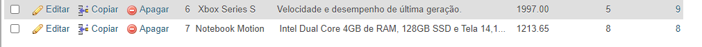

# Exercícios de Modelagem

**17/08/2023**

## Usando SQL em seu banco de dados `vendas`, insira mais dois produtos na tabela produtos:
1) Xbox Series S
    - Descrição: Velocidade e desempenho de última geração.
    - Valor: R$ 1.997,00
    - Quantidade: 5
    - Fabricante: Microsoft
2) Notebook Motion
    - Descrição: Intel Dual Core 4GB de RAM, 128GB SSD e Tela 14,1 polegadas.
    - Valor: R$ 1.213,65
    - Quantidade: 8
    - Fabricante: Positivo
# Exercício resolvido:


```sql
-- Código

INSERT INTO produtos(
    nome, descricao, preco, quantidade, fabricante_id
) 
VALUES (
    'Xbox Series S', 
    'Velocidade e desempenho de última geração',
    1997,
    5,
    9 -- id do fabricante Microssoft
), (
    'Notebook Motion',
    'Intel Dual Core 4GB de RAM, 128GB SSD e Tela 14,1 polegadas',
    1213.65,
    8,
    8 -- id do fabricante Positivo
);

-- 
```
`Visual`


---


**16/08/2023**

## Refaça o exercício anterior de modelagem física (banco de dados de catalogo de Filmes e Gêneros) usando somente ferramentas da interface gráfica do phpMyAdmin.


## Exercício resolvido:

1) etapa : <br>


2) etapa:


3) etapa:


4) etapa:


---

**15/08/2023**

## No phpMyAdmin utilize comandos SQL para fazer a modelagem física do exercício anterior.

Você deve:

- Criar um novo banco de dados (Catálogo de Filmes)
- Criar duas tabelas (Gêneros e Filmes)
- Fazer o relacionamento entre as tabelas

## Exercício resolvido:

```sql

-- Para criar um  banco de dados
CREATE DATABASE catalogo_de_filmes CHARACTER SET utf8mb4;

-- para criar a tabela Genêros 
CREATE TABLE generos(
    id INT NOT NULL PRiMARY KEY AUTO_INCREMENT,
    nome_genero VARCHAR(45) NOT NULL
); 


-- para criar a tabelas Filmes
CREATE TABLE filmes(
    id INT NOT NULL PRIMARY KEY AUTO_INCREMENT,
    titulo_filme VARCHAR(45) NOT NULL,
    ano_de_lancamento YEAR(4) NOT NULL,
    genero_id INT NOT NULL
);


-- para criar/referênciar a chave estrangeira 
ALTER TABLE filmes
    ADD CONSTRAINT fk_filmes_generos
    FOREIGN KEY (genero_id) REFERENCES generos(id); 


```

**15/08/2023**

## Crie no MySQL Workbench o modelo lógico para 2 entidades:

1) Gêneros
    - Identificador
    - Nome do gênero

2) Filmes
    - Identificador
    - Título do filme
    - Ano do lançamento
    - Gênero do Filme

**Obs.:** o filme deve ter um gênero relacionado à tabela de genêros.

---

## Exercício resolvido:

