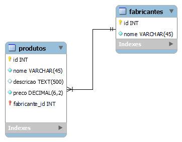

#  Modelagem Lógica usando MySQLworkbanch

Atividades de estudo de modelagem de banco de dados

## Exemplo de modelagem Lógicas

## Sobre tipos de Relacionamentos 

### 1:1

Relacionamento do tipo **1 para 1** 

### 1:n

Relacionamento do tipo **1 para n**, ou seja **1 para vários**. 

### n:m

Relacionamento do tipo **n para m**, ou seja **vários para vários**.

# Exercícios de Modelagem

## Crie no MySQL Workbench o modelo lógico para 2 entidades:

1) Gêneros
    - Identificador
    - Nome do gênero

2) Filmes
    - Identificador
    - Título do filme
    - Ano do lançamento
    - Gênero do Filme

**Obs.:** o filme deve ter um gênero relacionado à tabela de genêros.

###  Resolução do exercício:

