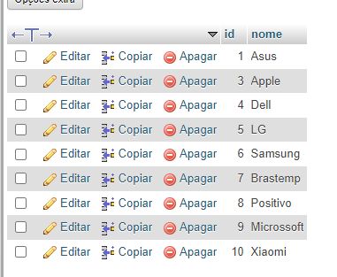
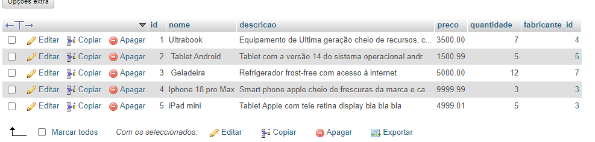

# Comandos Para Operações CRUD no Banco de Dados

## Resumo

- C -> CREATE (Inserir dados usando o comando `INSERT`)
- R -> READ (ler dados usando o comando `SELECT`)
- U -> UPDATE (atualizar dados usando o comando `UPDATE`)
- D -> DELETE (excluir dados usando o comando `DELETE`)

## INSERT

### Fabricantes

```sql
-- forma simples
INSERT INTO fabricantes(nome) VALUES('Asus');

INSERT INTO fabricantes(nome) VALUES('Apple');
INSERT INTO fabricantes(nome) VALUES('Dell');

-- concatenado
INSERT INTO fabricantes(nome) 
VALUES('LG'),('Samsung'),('Brastemp');

INSERT INTO fabricantes(nome) 
VALUES('Positivo'),('Microssoft'),('Xiaomi');

```
### Resultados



### Produtos

```sql

INSERT INTO produtos(
    nome, descricao, preco, quantidade, fabricante_id
) 
VALUES (
    'Ultrabook', 
    'Equipamento de Ultima geração cheio de recursos, com processador INTEL core i9 do balacobaco',
    3500,
    7,
    4 -- id do fabricante Dell
);


INSERT INTO produtos(
    nome, descricao, preco, quantidade, fabricante_id
) 
VALUES (
    ' Tablet Android', 
    'Tablet com a versão 14 do sistema operacional android possui tela de 10 polegadas e 128 GB, e 64 GB de RAM porque o ELIEL perguntou',
    1500.99,
    5,
    5 -- id do fabricante LG
);


INSERT INTO produtos(
    nome, descricao, preco, quantidade, fabricante_id
) 
VALUES (
    ' Geladeira', 
    'Refrigerador frost-free com acesso à internet',
    5000,
    12,
    7 -- id do fabricante Brastemp
), (
    'Iphone 18 pro Max',
    'Smart phone apple cheio de frescuras da marca e cara para caramba...coisa de rico',
    12666.66,
    3,
    3 -- id do fabricante Apple
), (
    'iPad mini',
    'Tablet Apple com tele retina display bla bla bla',
    4999.01,
    5,
    3 -- id do fabricante Apple
);
```
### Resultados



---

## SELECT (READ)

```sql

-- Query

-- Para exibir todas as colunas da tabela
SELECT * FROM produtos;
SELECT * FROM fabricantes;

-- Para exibir somente os nome e preço dos produtos
SELECT nome, preco FROM produtos;

-- mudando apenas a ordem de exibição
SELECT preco, nome FROM produtos;

-- Sendo mais criterioso
SELECT nome, preco, quantidade FROM produtos
     WHERE preco < 5000;

-- EXERCÍCIO: mostre nome e descrição só dos produtos da apple
SELECT nome, descricao FROM produtos
     WHERE fabricante_id = 3;

```

### Operadores Lógicos: E (AND), OU (OR), NÃO (NOT)


#### E

```sql
SELECT nome, preco FROM produtos 
    WHERE preco >= 2000 AND  preco <= 6000;

-- A query Abaixo não retorna registros 
-- já que as condições não foram totalmente atendidas atendidas
SELECT nome, preco FROM produtos 
    WHERE preco > 5000 AND  preco <= 6000;

```

#### OU

```sql

SELECT nome, preco FROM produtos 
    WHERE preco > 5000 OR  preco <= 3000;

-- EXERCÍCIO: Exiba nome e preço somente dos produtos da apple e da LG
SELECT nome, preco FROM produtos
    WHERE fabricante_id = 3 OR fabricante_id = 5;

-- Versão usando a função IN() 
-- IN = DENTRO
SELECT nome, preco FROM produtos
    WHERE fabricante_id IN(3, 5);

```

#### NÃO 

```sql

SELECT nome, descricao, preco FROM produtos
    WHERE NOT fabricante_id = 9;

-- Versão usando o operador relacional de diferença
-- ! = Diferente 
SELECT nome, descricao, preco FROM produtos
    WHERE  fabricante_id != 9;


SELECT nome, preco FROM produtos
    WHERE fabricante_id NOT IN(3,5);
```

---

## UPDATE

```sql
UPDATE fabricantes SET nome = 'Asus do Brasil'
    WHERE id = 1; -- ⚠️☠️NÃO SE ESQUEÇA DO WHERE!! PERIGO!☠️⚠️

UPDATE produtos SET preco = 6549.74
    WHERE id = 4;
-- Alteres a quantidade dos dos produtos da Apple e da LG para 20

UPDATE produtos SET quantidade = 20
    WHERE fabricante_id IN (3, 5); -- ⚠️☠️NÃO SE ESQUEÇA DO WHERE!! PERIGO!☠️⚠️


```

---

## DELETE

```sql
DELETE FROM fabricantes WHERE id = 1;  -- ⚠️☠️NÃO SE ESQUEÇA DO WHERE!! PERIGO!☠️⚠️

-- A query abaixo NÃO FUNCIONA devido à restrição de chave estrangeira/relacionamento, ou seja, existem produtos associados ao fabricante 3 (Apple)
-- DELETE FROM fabricantes WHERE id = 3;

```


